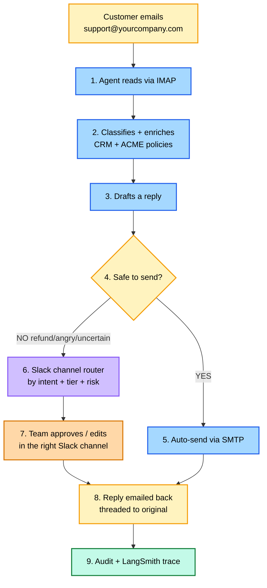
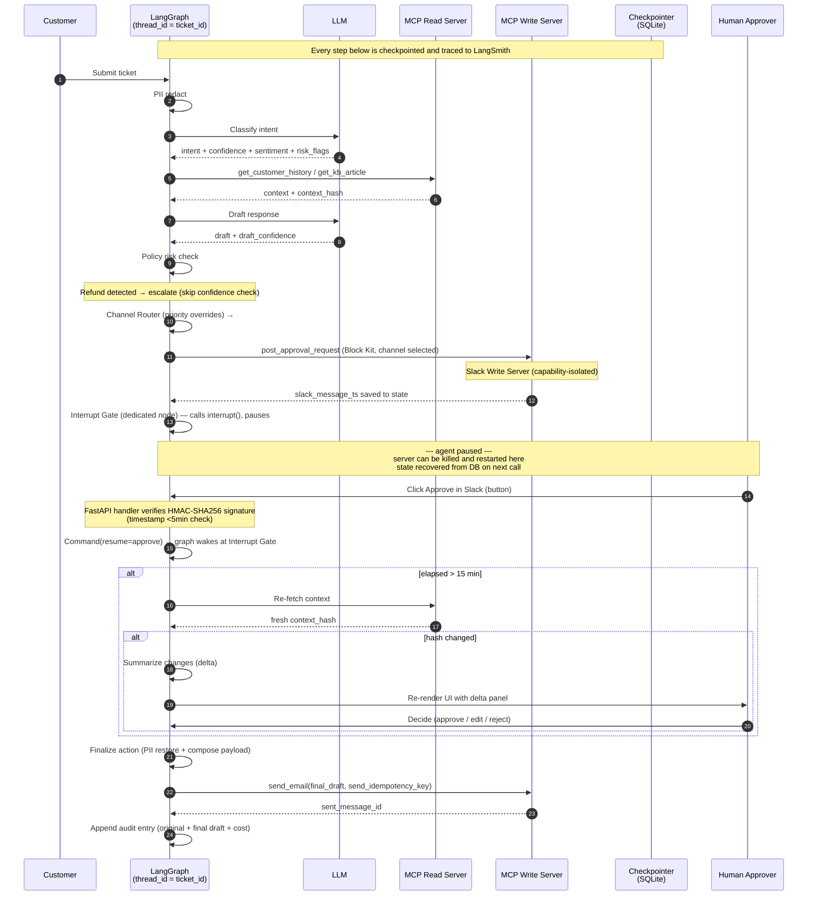
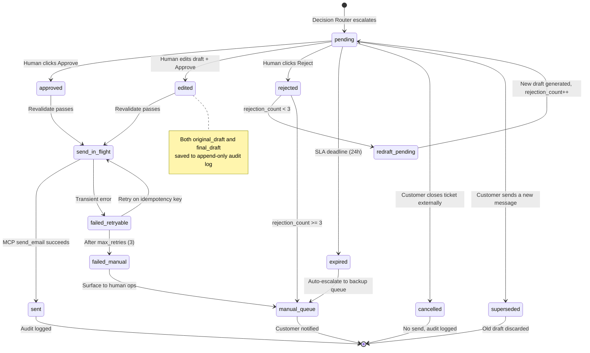

# HITL Customer Support Agent — Architecture

> A production-style customer support system that combines LLM reasoning, deterministic policy enforcement, and human approval workflows with durable execution. Real email I/O, real multi-channel Slack approvals, fictional ACME SaaS Co policy corpus, three capability-isolated MCP servers.

## System layers

The runtime decomposes into seven layers. Each has a single responsibility; every other doc and the codebase folder structure mirror this split.

| # | Layer | Responsibility | Where it lives |
|---|---|---|---|
| 1 | **Ingestion** | Pull customer email in, push reply email out | `src/email_listener.py` (IMAP) + MCP Email Write (SMTP) |
| 2 | **Orchestration** | Sequence nodes, persist state, recover from crashes | `src/graph.py` (LangGraph + SQLite checkpointer) |
| 3 | **Intelligence** | LLM calls — Classify, Draft, Summarize Changes | `src/llm.py` + `src/nodes.py` (OpenRouter / DeepSeek) |
| 4 | **Policy** | Two-gate routing + channel selection + KB retrieval | `src/policy.py` + `src/slack_router.py` + ACME KB via MCP Read |
| 5 | **HITL** | Slack notification, interrupt, action handler, edit modal | `src/server.py` + `src/slack_handler.py` + MCP Slack Write |
| 6 | **Execution** | Finalize payload, idempotent send, audit log | `src/nodes.py` (Finalize / Send Email / Audit) |
| 7 | **Observability** | Tracing, cost tracking, failure-slice tags | LangSmith decorators in `src/llm.py` |

A swap at any layer is a config change, not a rewrite. Production deployment replaces Gmail/IMAP with SES, mock CRM with Salesforce, ACME corpus with the company's actual policy docs — graph logic doesn't change.

## End-to-end flow (the 30-second view)



> Real email is the customer-facing I/O. Real Slack (with multi-channel routing by intent + customer tier + risk) is the internal team I/O. Step 4 collapses two distinct checks (policy risk + confidence) into one box for readability — the detailed flow below shows them split.

## Detailed flow

```mermaid
flowchart TD
    Inbox([support@yourcompany.com<br/>Gmail inbox]):::email
    Inbox --> Listener[Email Listener<br/>IMAP IDLE preferred<br/>poll ~30s as fallback]:::node
    Listener --> PII[PII Redact<br/>middleware]:::middleware
    PII --> Classify[Classify Intent<br/>intent + sentiment + risk_flags + risk_level]:::node
    Classify --> Enrich[Enrich Context<br/>CRM profile + history + ACME KB]:::node
    Enrich --> Draft[Draft Response]:::node
    Draft --> Policy{Policy Risk Check<br/>refund / angry / ACME policy match?}:::decision

    Policy -->|risk detected| Router{Channel Router<br/>priority overrides:<br/>1.legal > 2.enterprise+risk<br/>3.angry > 4.intent}:::decision
    Policy -->|no risk| Confidence{Confidence Check<br/>both confidences >= 0.85?}:::decision
    Confidence -->|below threshold| Router
    Confidence -->|above threshold| Finalize

    Router -->|legal/compliance| ChLegal[#support-legal]:::slack
    Router -->|enterprise + risk| ChEnt[#support-enterprise]:::slack
    Router -->|angry| ChCmp[#support-complaints]:::slack
    Router -->|by intent| ChIntent[#support-refunds /<br/>-technical / -billing]:::slack

    ChLegal --> SlackPost
    ChEnt --> SlackPost
    ChCmp --> SlackPost
    ChIntent --> SlackPost
    SlackPost[Slack Notification<br/>posts Block Kit message<br/>saves slack_message_ts<br/>NO interrupt yet]:::ui

    SlackPost --> Interrupt[Interrupt Gate<br/>dedicated node — only interrupt&#40;&#41;<br/>checkpointer persists at super-step<br/>resumes via webhook]:::hitl

    Interrupt -->|webhook signature verified<br/>Command resume| Action{Action?}:::decision
    Action -->|reject + reason| RejectCheck{rejection_count >= 3?}:::decision
    Action -->|approve or edit| Elapsed{Approval delay > 15min?}:::decision

    RejectCheck -->|yes| ManualQueue[Manual Queue<br/>posts final status to channel,<br/>customer notified by email]:::terminal
    RejectCheck -->|no, count++<br/>carry rejection_reason| Draft

    Elapsed -->|no| Finalize
    Elapsed -->|yes| Revalidate{Revalidate Context<br/>compare context_hash}:::decision
    Revalidate -->|hash unchanged| Finalize
    Revalidate -->|hash changed| Summarize[Summarize Changes<br/>compute delta]:::node
    Summarize -->|update_message:<br/>posts delta on same msg<br/>graph re-interrupts to wait| Interrupt

    Finalize[Finalize Action<br/>PII restore + compose payload<br/>+ In-Reply-To AND References headers<br/>+ Subject: Re: ... for threading]:::node
    Finalize --> SendEmail[Send Email<br/>Gmail SMTP<br/>app-layer idempotency:<br/>skip if sent_message_id present]:::node

    SendEmail -. SMTP .-> CustInbox([Customer inbox<br/>reply threaded under original]):::email
    SendEmail --> Audit[Append-only audit log +<br/>LangSmith trace closes]:::terminal
    Audit --> End([End]):::terminal

    Enrich -. read .-> MCPRead[(MCP Read Server<br/>get_crm_profile<br/>get_customer_history<br/>get_kb_article)]:::mcpread
    SendEmail -. write .-> MCPEmail[(MCP Email Write<br/>send_email via Gmail SMTP)]:::mcpemail
    SlackPost -. write .-> MCPSlack[(MCP Slack Write<br/>post_approval_request<br/>update_message<br/>views.open for Edit modal)]:::mcpslack
    Summarize -. write .-> MCPSlack
    ManualQueue -. write .-> MCPSlack

    classDef email fill:#fff3bf,stroke:#f59e0b,stroke-width:2px,color:#000
    classDef middleware fill:#d0bfff,stroke:#8b5cf6,stroke-width:2px,color:#000
    classDef node fill:#a5d8ff,stroke:#2563eb,stroke-width:2px,color:#000
    classDef decision fill:#fff3bf,stroke:#f59e0b,stroke-width:2px,color:#000
    classDef hitl fill:#ffc9c9,stroke:#dc2626,stroke-width:2px,color:#000
    classDef slack fill:#e9d5ff,stroke:#7e22ce,stroke-width:2px,color:#000
    classDef ui fill:#ffd8a8,stroke:#d97706,stroke-width:2px,color:#000
    classDef mcpread fill:#99e9f2,stroke:#0891b2,stroke-width:2px,color:#000
    classDef mcpemail fill:#fcc2d7,stroke:#be185d,stroke-width:2px,color:#000
    classDef mcpslack fill:#fde68a,stroke:#a16207,stroke-width:2px,color:#000
    classDef terminal fill:#c3fae8,stroke:#15803d,stroke-width:2px,color:#000
```

### Key design points

- **Slack post happens BEFORE interrupt, never after.** Once `interrupt()` fires, execution pauses — nothing else in that node runs. The graph order is: `Channel Router → Slack Notification (posts message, saves ts) → Interrupt Gate (dedicated node, just calls interrupt())`. The webhook resumes the graph at the Interrupt Gate, then routes by action. Reversing this order is a flow-correctness bug that pauses forever with no Slack message ever sent.
- **Real email is the customer-facing I/O.** Gmail IMAP IDLE (sub-second push) preferred; 30s polling as fallback. Gmail SMTP delivers replies threaded under the original — requires `In-Reply-To` AND `References` headers AND a matching `Subject: Re: ...` (Gmail uses all three). Production swap → SendGrid/SES is an MCP server change, no graph logic change.
- **Real Slack is the internal team I/O.** No web dashboard humans need to remember to check. Approvals live in the channel they already work in. Edit opens a Slack modal via `views.open` (not a redirect to a separate web UI) — keeps the human in Slack throughout.
- **Slack webhook signatures are verified, not trusted.** The FastAPI handler computes HMAC-SHA256 of `v0:{X-Slack-Request-Timestamp}:{raw body}` with the signing secret, compares to `X-Slack-Signature`, and rejects if mismatch or timestamp older than 5 minutes (replay defense). Without this, anyone who finds the webhook URL can fake an Approve.
- **Channel routing is priority-ordered, not fuzzy.** `legal/compliance > enterprise+risk > angry > by-intent`. Documented in `slack_router.py` and unit-tested. Enterprise customers never get triaged in the Free-tier queue.
- **Policy and confidence are separate gates.** A high-confidence refund still escalates. Order matters: policy first, confidence second — fast-fail on the cheaper check.
- **Policies are real data, not hardcoded thresholds.** `data/acme_policies.md` is a fictional but rigorous policy corpus for ACME SaaS Co. The Policy Risk Check retrieves matching policy chunks via MCP and quotes them verbatim in the Slack approval. Production swap → company's actual policy docs in the same MCP shape.
- **Revalidation threshold (15 min) is a tunable engineering decision, not a magic number.** Sub-15min: customer state rarely changes meaningfully. Over 15min: meaningful chance of CRM updates (subscription change, new ticket, billing event). Threshold is config-driven and tunable per tenant. When `context_hash` changed during a long pause, `Summarize Changes` posts a delta `update_message` on the same Slack thread (not a silent redraft) so the approver re-decides with full info.
- **Finalize is split from Send.** Finalize composes (PII restore + payload assembly + threading headers); Send executes the irreversible SMTP call.
- **Send idempotency is application-layer, not protocol-layer.** SMTP itself does not deduplicate. Before each call, the Send node checks `sent_message_id` in state — if populated, skip. The `send_idempotency_key` is the lookup, the state field is the lock. This is what "idempotent send" actually means in code.
- **State persistence is implicit, not localized to one node.** LangGraph's checkpointer persists state across the thread (`thread_id = ticket_id`). Full checkpoints save at super-step boundaries, with task-level writes preserved during super-steps for fault recovery. After a server restart, `slack_message_ts` lets resume target the exact Slack message the human sees.
- **Reject paths capture the reason and bound the loop.** Reject button opens a small modal: *"Why? (optional)"*. The reason is stored as `rejection_reason` in state. Below 3 rejections → redraft uses the original ticket *plus the rejection reason* as additional context, posts the new draft as a Slack thread reply on the same message (preserves audit history). At 3 → Manual Queue with a final notice in the channel.
- **MCP servers are split by capability into three.** Read (CRM + KB) cannot send. Email Write cannot post Slack. Slack Write cannot email. Prompt injection during retrieval cannot reach the customer's inbox or the Slack channel — blast radius bounded by server boundary.

## Implementation rules (LangGraph-specific)

These two rules prevent the most common bugs when implementing HITL on LangGraph. They are not optional — getting either wrong silently breaks the agent.

### Rule 1 — `interrupt()` lives in its own dedicated node

The `interrupt()` call must be alone in its node. No DB writes, MCP calls, audit log entries, or any other side effect can share the node.

**Why:** When LangGraph resumes after `interrupt()`, the node containing the call restarts from the beginning. Any code before the interrupt runs again on every resume. Side effects in that node duplicate.

**Pattern:** Put side effects in *downstream* nodes that run exactly once per resume. The interrupt node does only the pause.

### Rule 2 — Never wrap `interrupt()` in `try/except`

`interrupt()` works by raising a special exception that the LangGraph runtime catches. A broad `try/except` swallows the exception; the graph either hangs or skips the pause entirely.

**Why:** Generic "robust error handling" patterns break HITL. It's tempting to wrap everything for safety, but the interrupt path must bubble up to the runtime.

**Pattern:** Error handling lives in *other* nodes, not the interrupt node.

## Failure modes — what happens when things go wrong

Every failure has an explicit handling path. None are silent.

| Failure | What the system does |
|---|---|
| Server crashes mid-pause | LangGraph SQLite checkpoint persists at the last super-step. On restart, the Slack message buttons still work — webhook resumes at the Interrupt Gate using `slack_message_ts`. State recovered exactly. |
| SMTP transient failure | `send_retry_count++`. Up to 3 retries, all using the same `send_idempotency_key` (app-layer check on `sent_message_id` in state). After 3 → `failed_manual` → Manual Queue + Slack notice. |
| No human responds in 1h | Agent re-pings the channel: *"⏰ Still pending — backup channel paged."* If still no response by `sla_deadline` (24h) → auto-escalate to Manual Queue. |
| Customer sends follow-up email mid-pause | `ticket_external_status` flips to `superseded`. Old draft discarded. Slack message updates: *"⚠️ Customer replied — superseded, see ticket-XXXX."* Follow-up enters as new ticket. |
| Customer cancels ticket externally | `ticket_external_status` flips to `cancelled`. Slack message updates: *"🚫 Customer cancelled — closing."* No send. |
| Prompt injection in customer email | Read MCP server has no `send_email` and no `post_slack`. Even if a jailbreak fires during retrieval, the agent has no path to either I/O channel until the explicit Send / Slack Write nodes. Capability separation = bounded blast radius. |
| Slack webhook signature mismatch | FastAPI handler returns 401, no resume happens. Logged as security event. |
| Slack timestamp older than 5min | Replay attack defense. Rejected with 401. |
| Human rejects 3 times | Auto-routes to Manual Queue. Slack message: *"🚦 3 rejections — manual queue."* Customer notified by email. |
| LangSmith down | Agent continues. Traces buffer locally, replay when LangSmith returns. Observability outage does not break user flow. |
| LLM rate-limited or timing out | Single retry with backoff. Second failure → escalate to human (treat as low confidence). |
| Hash unchanged but human delays >24h | SLA expires anyway. Manual Queue. Time-based override of staleness check. |

## Color legend

| Color | Meaning |
|---|---|
| Blue | Standard graph nodes |
| Purple (light) | Middleware (PII redact / restore) |
| Yellow rounded | Email entry/exit (real Gmail in/out) |
| Yellow diamond | Decision / router |
| Red | HITL pause boundary |
| Light purple | Slack channel (one of `#support-legal/-enterprise/-complaints/-refunds/-technical/-billing`) |
| Orange | Slack notification block (the message with Approve/Edit/Reject) |
| Cyan | MCP **Read** server (`get_crm_profile`, `get_customer_history`, `get_kb_article`) |
| Pink | MCP **Email Write** server (Gmail SMTP `send_email`) |
| Yellow (gold) | MCP **Slack Write** server (`post_approval_request`, `update_message`) |
| Green | Audit log / manual queue / done (terminal states) |

## Routing rules

Two sequential gates, not one fuzzy router.

### Gate 1 — Policy Risk Check
Escalate if **any** true:
- Refund or money mention
- Angry sentiment
- Edge-case intent
- Explicit policy match (cancellation, billing dispute, account recovery, legal)

### Gate 2 — Confidence Check (only runs if Gate 1 passes)
Escalate if `intent_confidence < 0.85` OR `draft_confidence < 0.85`.

Auto-send only when **both gates pass** AND `intent in {FAQ, info, basic_technical}`.

**Primary safety metric:** `false_auto_send_rate = 0%`

## Approval UI specification

The UI is designed so a human can decide in ~10 seconds, not 2 minutes.

### Layout

1. **Customer message + thread history**
2. **Why I paused** — risk breakdown panel:
   ```
   refund_detected:  true
   sentiment:        angry (0.91)
   intent_conf:      0.72  (below 0.85 threshold)
   draft_conf:       0.81  (below 0.85 threshold)
   policy_match:     refund_over_$100

   Justification (from KB):
   "Refunds above $100 require manager approval per Policy 4.2.1"
   ```
   The justification quote is pulled from `retrieved_context` — the same data the LLM used to draft the response — so the human sees the exact policy sentence the agent matched against. This is the difference between explainable AI and "trust me."
3. **Detected intent + confidence**
4. **Draft response** — editable text area
5. **Three actions:** Approve · Edit & Approve · Reject

### Stale-context delta panel (only shown when context changed during pause)

If `Revalidate` detects the context_hash changed, the UI re-renders with an additional panel above the draft:

```
Context changed since this draft was created (2h 14min ago):
  - account_status:  Active  →  Pending
  - open_tickets:    1       →  3
```

The human can still Approve/Edit/Reject, now informed.

### Why this matters

Most HITL UIs show the draft and ask "approve?" The "why I paused" panel + KB justification + delta panel together turn this into a true explainable-AI surface. Glance at five fields, decide instantly.

## Sequence — single ticket, HITL path



## State machine — `approval_status`, `send_status`, terminal states



## State schema additions

Beyond the base schema in `spec.md §5`, these fields are required for production-quality observability and correctness:

```python
# Routing inputs (drive the Channel Router and gates)
customer_tier: str                   # Free / SMB / Enterprise (from CRM)
risk_level: str                      # none / financial / legal / compliance
policy_matches: list                 # ["ACME 4.2.1", "ACME 7.1"] — KB sections that triggered escalation

# Real I/O channels (email + Slack)
email_thread_id: str                 # original customer email RFC-822 Message-ID; used for In-Reply-To + References threading
slack_channel: str                   # which channel the approval went to (e.g. "#support-complaints")
slack_message_ts: str                # Slack message timestamp; used to update / resume on the right msg

# Idempotency on send (app-layer, not SMTP-layer)
send_idempotency_key: str            # set once at entry; lookup key for the dedupe check
sent_message_id: Optional[str]       # populated after SMTP returns; presence == "already sent" — Send node skips if set

# Cost / token tracking
cost_breakdown: dict                 # {classify: 0.0001, draft: 0.0008, ...}
total_tokens: int
total_cost_usd: float

# Long-pause edge cases
ticket_external_status: str          # open / closed_by_customer / superseded
sla_deadline: datetime               # SLA expiry; once passed without a human decision → manual_queue

# Loop guards
human_rejection_count: int           # increments on each rejection; >= 3 routes to manual_queue
rejection_reason: Optional[str]      # free-text from Slack reject modal; carried into next Draft as context
send_retry_count: int                # increments on each transient send failure; >= 3 routes to failed_manual
```

### Tunable thresholds (env vars)

| Env var | Default | What it controls |
|---|---|---|
| `REVALIDATE_THRESHOLD_MIN` | 15 | Minutes after which an approval triggers context revalidation before send |
| `MAX_HUMAN_REJECTIONS` | 3 | Reject count that flips redraft loop to Manual Queue |
| `MAX_SEND_RETRIES` | 3 | Transient-failure retry cap before `failed_manual` |
| `SLA_DEADLINE_HOURS` | 24 | Hours of human silence before SLA expires to Manual Queue |
| `IMAP_POLL_INTERVAL_SEC` | 30 | Polling fallback when IMAP IDLE is unavailable |

## LangSmith tagging

Every trace is tagged with the following so the LangSmith UI supports failure-slice analysis:

| Tag | Values |
|---|---|
| `graph_version` | `v1` / `v2` / `v3` |
| `intent` | `refund` / `billing` / `technical` / `complaint` / `FAQ` / `other` |
| `outcome` | `auto_send` / `escalated` |
| `human_edited` | `true` / `false` |
| `final_state` | `sent` / `rejected` / `expired` / `cancelled` / `superseded` / `failed_manual` |
| `risk_flags` | comma-joined list (e.g., `refund,angry`) |
| `confidence_bucket` | `lt_0.5` / `0.5-0.85` / `gte_0.85` |

These tags drive the README's failure-slice table — break down accuracy by `intent + risk_flags` and you see exactly where v1 → v2 → v3 improvements landed.

## Eval data

The eval suite runs against the **Bitext Customer Support dataset** (50-ticket sample: 40 dev / 10 holdout). Five evaluators run via LangSmith:
1. Intent accuracy (exact-match against labels)
2. Response quality (LLM-as-judge with rubric)
3. Escalation precision (did the two-gate router send to human correctly?)
4. **False auto-send rate** — primary safety metric, target 0%
5. Failure slice analysis — accuracy broken down by `intent × risk_flags × confidence_bucket`

## How this maps to the codebase

| Diagram region | Files |
|---|---|
| Email Listener (IMAP IDLE / poll) | `src/email_listener.py` |
| PII redact + restore middleware | `src/pii.py` |
| Classify, Enrich Context, Draft, Summarize Changes, Finalize, Audit nodes | `src/nodes.py` |
| Policy + Confidence routing, rejection-count guard | `src/policy.py` |
| Channel Router with priority overrides (legal > enterprise+risk > angry > intent) | `src/slack_router.py` |
| Interrupt + checkpointer wiring | `src/graph.py` |
| FastAPI server + Slack webhook signature verification + edit modal fallback | `src/server.py` + `src/slack_handler.py` + `ui/edit.html` |
| MCP **Read** server (CRM + KB) | `mcp_server/support_read.py` |
| MCP **Email Write** server (Gmail SMTP, idempotent) | `mcp_server/support_email_write.py` |
| MCP **Slack Write** server (post / update / views.open) | `mcp_server/support_slack_write.py` |
| MCP client (routes calls to correct capability-isolated server) | `src/mcp_client.py` |
| LLM client + LangSmith tracing decorators | `src/llm.py` |
| ACME SaaS Co fictional policy corpus | `data/acme_policies.md` |
| Mock customer DB (Salesforce-shape) | `data/customers_seed.json` |
| Bitext eval dataset (50-ticket sample) | `data/bitext_sample.csv` |
| Restart / resume integration test | `tests/test_resume.py` |

## Future work

- **Human edits as a golden dataset** — accumulated `(original_draft, final_draft)` pairs from the audit log become a high-signal fine-tuning or prompt-tuning corpus for the drafter. Run weekly: compute `edit_distance` per intent, surface drift, feed back into prompt iteration. This is the v4 narrative.
- **Postgres for production** — SQLite checkpointer is single-writer; Postgres supports concurrent agents and cross-region replicas.
- **Webhook-based inbound mail** — replace IMAP IDLE listener with SES / SendGrid Inbound Parse / Postmark for sub-second latency at scale without keepalive overhead.
- **Online evals** — currently 50-ticket offline; add a sampling layer that scores live traces in LangSmith so quality regressions are caught in production, not in retrospect.
- **Multi-model routing** — cheap classifier model (Haiku-tier) for Gate 1 + expensive drafter (Sonnet-tier) for Step 4. Likely meaningful cost reduction on auto-send tickets; quantify after build.
- **Admin debug view** — expose `graph.get_state()` / `graph.get_state_history()` to inspect any thread's full execution history during incident response.
- **Real CRM / ticketing integration** — swap mock `support_read.py` for Salesforce/HubSpot API; swap email-direct entry for Zendesk Conversations API. MCP server replacement, no graph logic changes.
