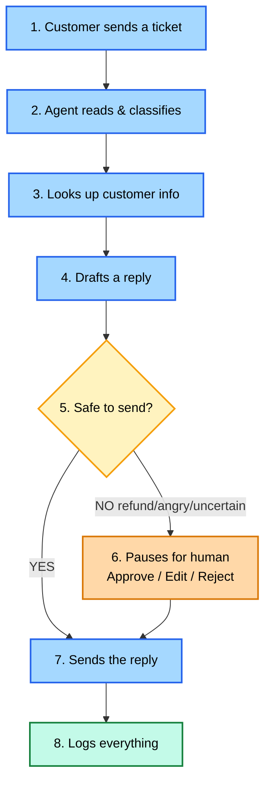
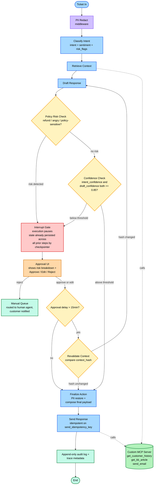
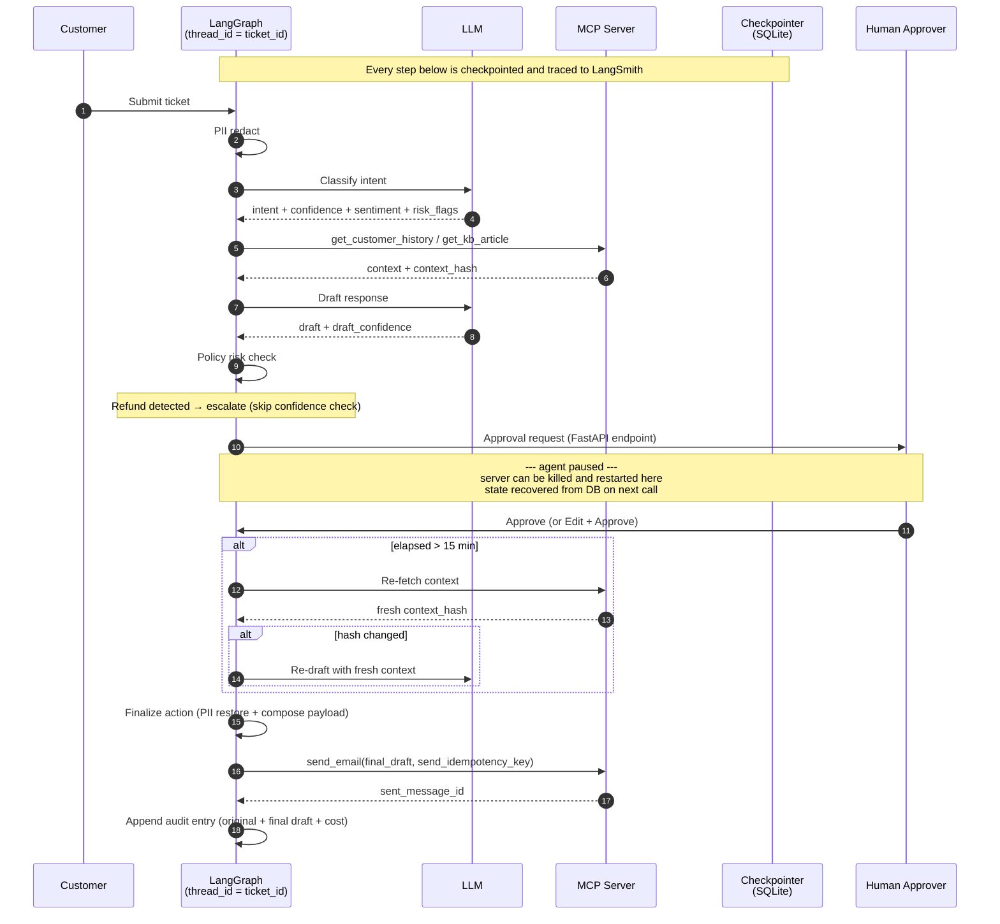
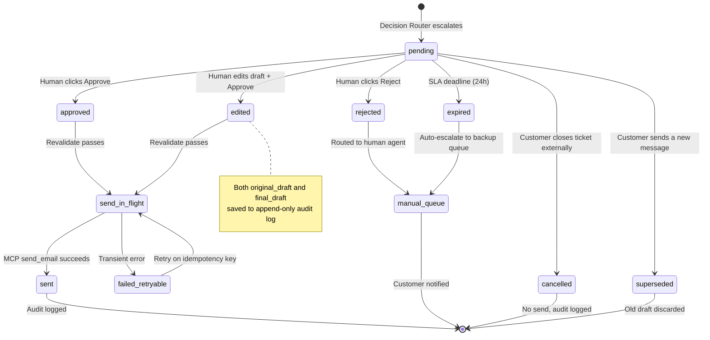

# HITL Customer Support Agent — Architecture

## End-to-end flow (the 30-second view)



> Step 5 collapses two distinct checks (policy risk + confidence) into one box for readability. The detailed flow below shows them split.

## Detailed flow



### Key design points

- **Policy and confidence are separate gates.** A high-confidence refund still escalates. Order matters: policy first, confidence second — fast-fail on the cheaper check.
- **Revalidation is gated by elapsed time.** Fast approvals skip the re-fetch entirely. Stale-context redraft only happens when the hash actually changed.
- **Finalize is split from Send.** Finalize composes (PII restore + payload assembly); Send executes the irreversible side effect. Send is idempotent on `send_idempotency_key` so retries cannot double-send.
- **State persistence is implicit, not localized to one node.** LangGraph's checkpointer persists every step across the thread (`thread_id = ticket_id`). The Interrupt Gate just pauses execution — it doesn't trigger the checkpoint.
- **Reject routes to a manual queue, not a black hole.** Customer always gets handled, just by a person instead of the agent.

## Color legend

| Color | Meaning |
|---|---|
| Blue | Standard graph nodes |
| Purple | Middleware (PII redact / restore) |
| Yellow diamond | Decision / router |
| Red | HITL pause boundary |
| Orange | Human-facing UI |
| Green (panel) | MCP tool server |
| Green (terminal) | Audit log / manual queue / done |

## Routing rules

Two sequential gates, not one fuzzy router.

### Gate 1 — Policy Risk Check
Escalate if **any** true:
- Refund or money mention
- Angry sentiment
- Edge-case intent
- Explicit policy match (cancellation, billing dispute, account recovery, legal)

### Gate 2 — Confidence Check (only runs if Gate 1 passes)
Escalate if `intent_confidence < 0.85` OR `draft_confidence < 0.85`.

Auto-send only when **both gates pass** AND `intent in {FAQ, info, basic_technical}`.

**Primary safety metric:** `false_auto_send_rate = 0%`

## Approval UI specification

The UI is designed so a human can decide in ~10 seconds, not 2 minutes.

### Layout

1. **Customer message + thread history**
2. **Why I paused** — risk breakdown panel:
   ```
   refund_detected:  true
   sentiment:        angry (0.91)
   intent_conf:      0.72  (below 0.85 threshold)
   draft_conf:       0.81  (below 0.85 threshold)
   policy_match:     refund_over_$100
   ```
3. **Detected intent + confidence**
4. **Draft response** — editable text area
5. **Three actions:** Approve · Edit & Approve · Reject

### Why this matters

Most HITL UIs show the draft and ask "approve?" The "why I paused" panel is the difference between a human reading the whole thread to understand context and a human glancing at five fields and deciding instantly.

## Sequence — single ticket, HITL path



## State machine — `approval_status`, `send_status`, terminal states



## State schema additions

Beyond the schema in `spec.md §5`, these fields are required for production-quality observability and correctness:

```python
# Idempotency on send
send_idempotency_key: str           # set once at entry; used by Send to deduplicate retries
sent_message_id: Optional[str]      # populated after MCP returns; presence == "already sent"

# Cost / token tracking
cost_breakdown: dict                # {classify: 0.0001, draft: 0.0008, ...}
total_tokens: int
total_cost_usd: float

# Long-pause edge cases
ticket_external_status: str         # open / closed_by_customer / superseded
sla_deadline: datetime
```

## LangSmith tagging

Every trace is tagged with the following so the LangSmith UI supports failure-slice analysis:

| Tag | Values |
|---|---|
| `graph_version` | `v1` / `v2` / `v3` |
| `intent` | `refund` / `billing` / `technical` / `complaint` / `FAQ` / `other` |
| `outcome` | `auto_send` / `escalated` |
| `human_edited` | `true` / `false` |
| `final_state` | `sent` / `rejected` / `expired` / `cancelled` / `superseded` |
| `risk_flags` | comma-joined list (e.g., `refund,angry`) |
| `confidence_bucket` | `lt_0.5` / `0.5-0.85` / `gte_0.85` |

These tags drive the README's failure-slice table — break down accuracy by `intent + risk_flags` and you see exactly where v1 → v2 → v3 improvements landed.

## How this maps to the codebase

| Diagram region | Files |
|---|---|
| PII redact + restore middleware | `src/pii.py` |
| Classify, Retrieve, Draft, Finalize, Audit nodes | `src/nodes.py` |
| Policy + Confidence routing | `src/policy.py` |
| Interrupt + checkpointer wiring | `src/graph.py` |
| Approval UI + endpoints | `src/server.py` + `ui/approve.html` |
| MCP server | `mcp_server/support_tools.py` + `src/mcp_client.py` |
| LangSmith tracing decorators | `src/llm.py` |
| Restart / resume integration test | `tests/test_resume.py` |

## Future work

- **Human edits as a golden dataset** — accumulated `(original_draft, final_draft)` pairs from the audit log become a high-signal fine-tuning or prompt-tuning corpus for the drafter. Run weekly: compute `edit_distance` per intent, surface drift, feed back into prompt iteration. This is the v4 narrative.
- **Postgres for production** — SQLite checkpointer is single-writer; Postgres supports concurrent agents and cross-region replicas.
- **Slack approval channel** — extend the Approval UI to a Slack interactive message for on-call workflows.
- **Online evals** — currently 50-ticket offline; add a sampling layer that scores live traces in LangSmith so quality regressions are caught in production, not in retrospect.
- **Multi-model routing** — cheap classifier model (Haiku-tier) for Gate 1 + expensive drafter (Sonnet-tier) for Step 4. Cuts cost by ~5x on auto-send tickets.
